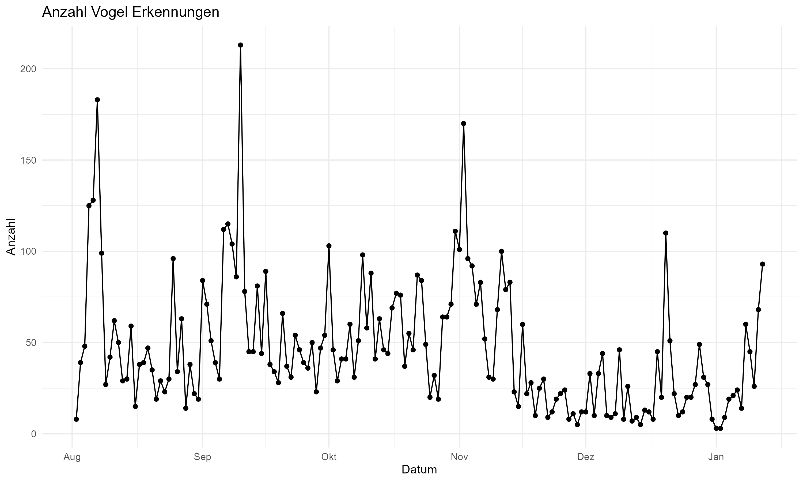
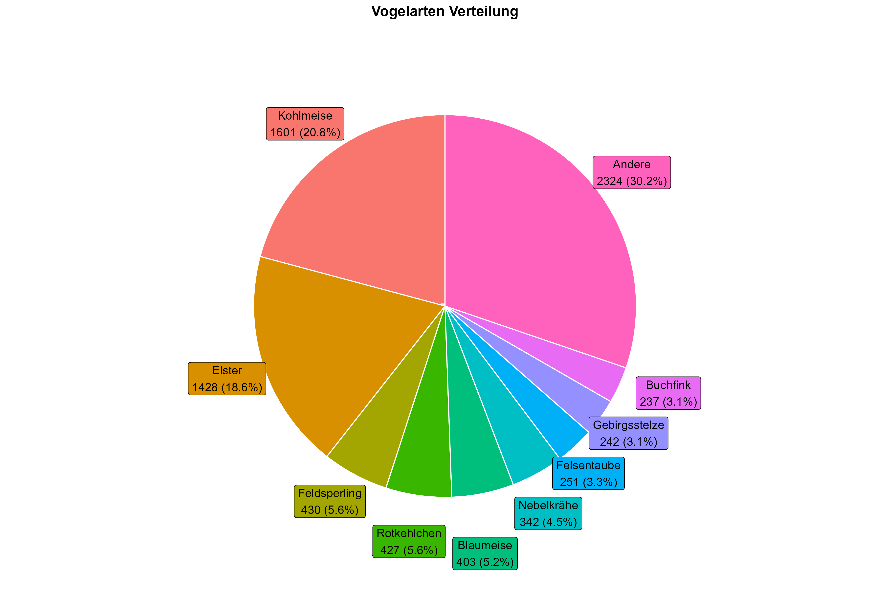
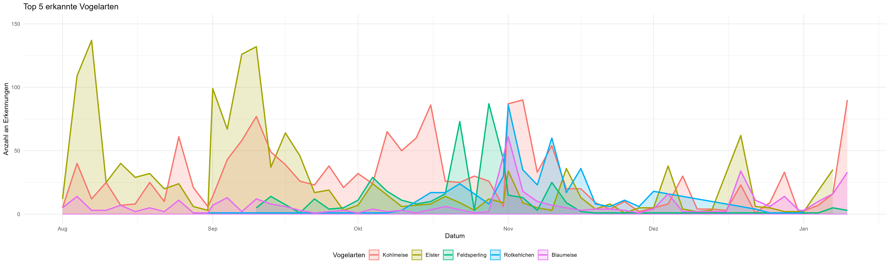
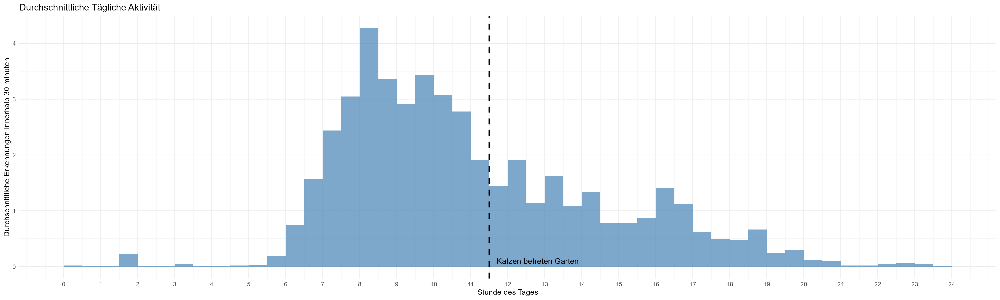

# BirdNET-Pi Visualisierung
Visualisierung der Vogelgesang-Aufnahmen in unserem Garten. Aufgenommen durch [BirdNET-Pi](https://github.com/Nachtzuster/BirdNET-Pi), welches Vogelgesang aufnimmt und durch ein NN klassifiziert. Alle Graphiken erstellt mit R.

# Anzahl Aufnahmen
Die Aufnahmen des Vogelgesangs sind von August 2025 - Januar 2026.

# Verteilung der Vogelarten
Währenddessen wurden viele unterschiedliche Vogelarten erkannt.
Vor allem Kohlmeisen und Elstern waren zu dieser Zeit in unserem Garten.

Anfang August und September wurden größtenteils Elstern aufgenommen. Kohlmeisen blieben relativ konstant in ihrer Präsenz.

# Tägliches verhalten der Vögel
Betrachten wir die Uhrzeiten, zu denen die Vögel da sind, kann folgendes Muster erkannt werden:

Generell kann man hierin sehen, dass die Anzahl an aufgenommenen Vögeln deutlich abnimmt, sobald die Katzen aus dem Haus und in den Garten gelassen werden, was druchschnittlich zwischen 11 und 12 Uhr geschieht.

